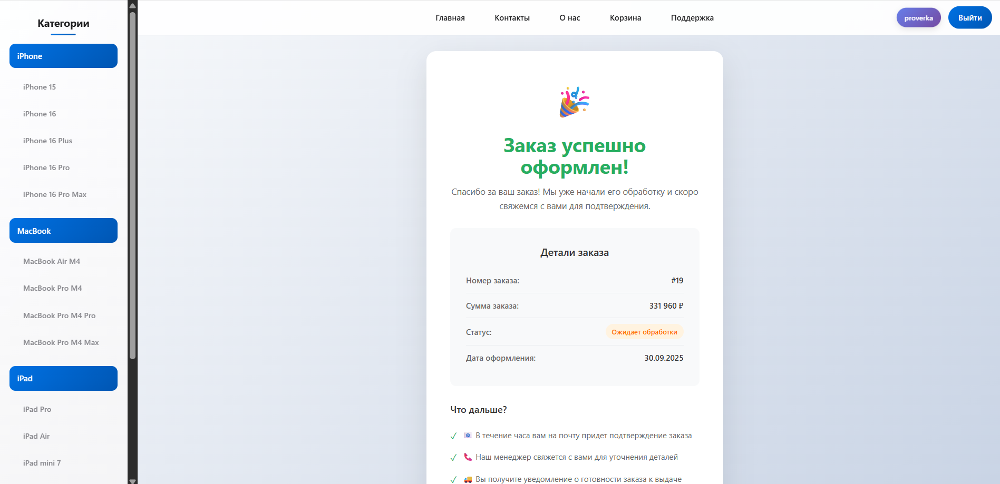

#  Apple Shop - Интернет-магазин техники Apple

**Frontend часть интернет-магазина**

[Функциональность](#-функциональность) • [Скриншоты](#-скриншоты) • [Технологии](#-технологии)

##  Функциональность

###  **Каталог товаров**
- Просмотр всего ассортимента техники Apple
- Группировка товаров по категориям (iPhone, MacBook, iPad, Apple Watch)
- Адаптивная сетка товаров с плавными анимациями
- Быстрая навигация между разделами

###  **Страницы товаров** 
- Детальная информация о каждом товаре
- Выбор характеристик (цвет, память, размер экрана)
- Подбор комплектаций под разные страны
- Просмотр изображений товаров
- Подробные технические характеристики

###  **Корзина покупок**
- Добавление/удаление товаров
- Изменение количества товаров
- Просмотр итоговой суммы
- Локальное сохранение корзины
- Анимации при взаимодействии

###  **Оформление заказа**
- Многостраничный процесс оформления
- Ввод контактных данных
- Выбор способа доставки
- Подтверждение заказа
- Страница успешного оформления

###  **Пользовательский интерфейс**
- Адаптивный дизайн для всех устройств
- Плавные анимации и переходы
- Интуитивная навигация

###  **Информационные страницы**
- Страница "О компании" с преимуществами
- Контактная информация
- Страница поддержки с FAQ
- Описание ценностей компании

##  Примечание

Данный репозиторий содержит только **frontend часть** приложения. Для полной функциональности (обработка заказов, работа с базой данных, аутентификация) требуется запуск backend сервера.

##  Скриншоты

<!-- Добавь скриншоты когда сделаешь -->
###  Главная страница

###  Страница товара

###  Корзина покупок

###  Оформление заказа

###  Подтверждение заказа

##  Технологии

- **Frontend:** React 18, React Router DOM
- **Стили:** CSS3, CSS Modules  
- **Анимации:** Framer Motion
- **Состояние:** React Context API + LocalStorage
- **Маршрутизация:** React Router v6
- **HTTP клиент:** Fetch API
- **Backend:** Node.js + Express (отдельный репозиторий)

---

